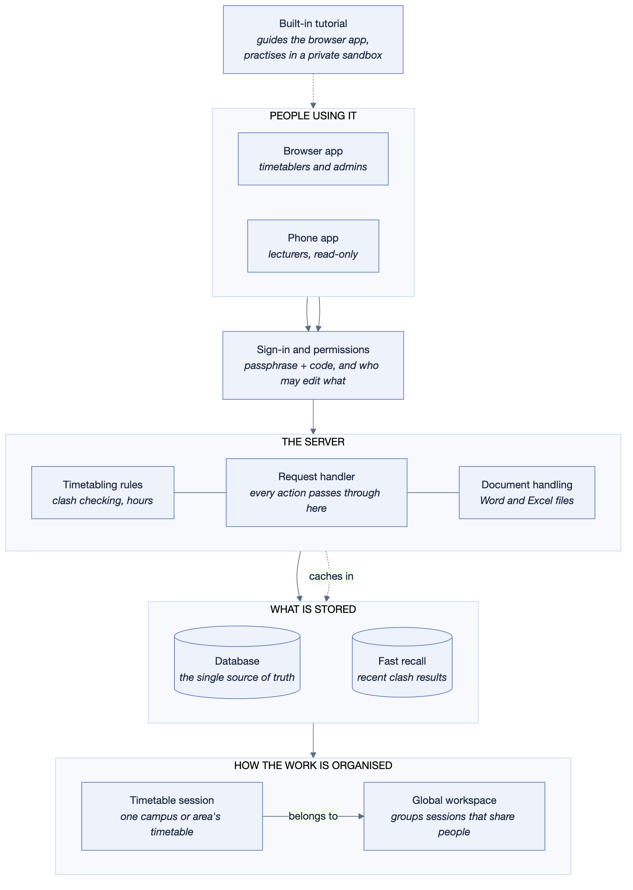
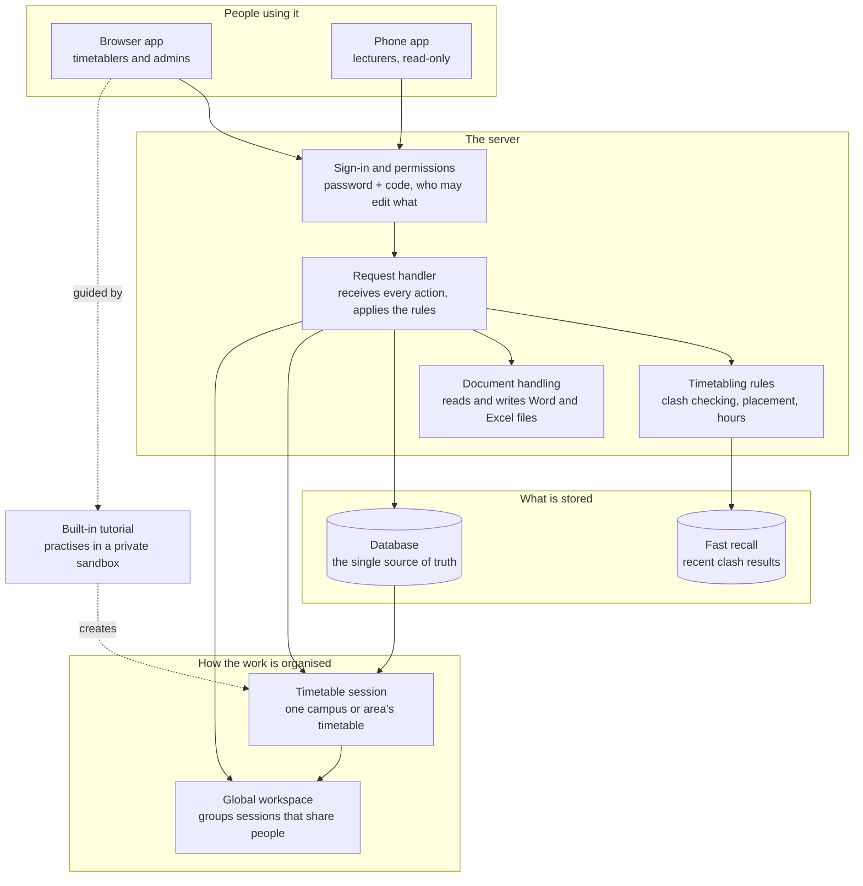
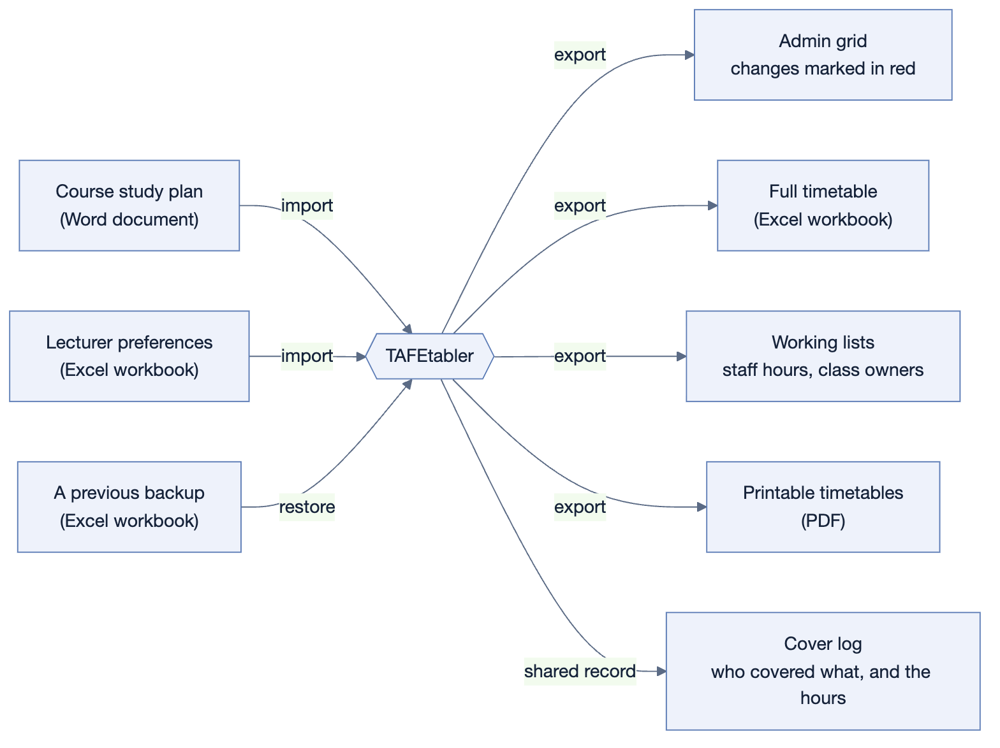
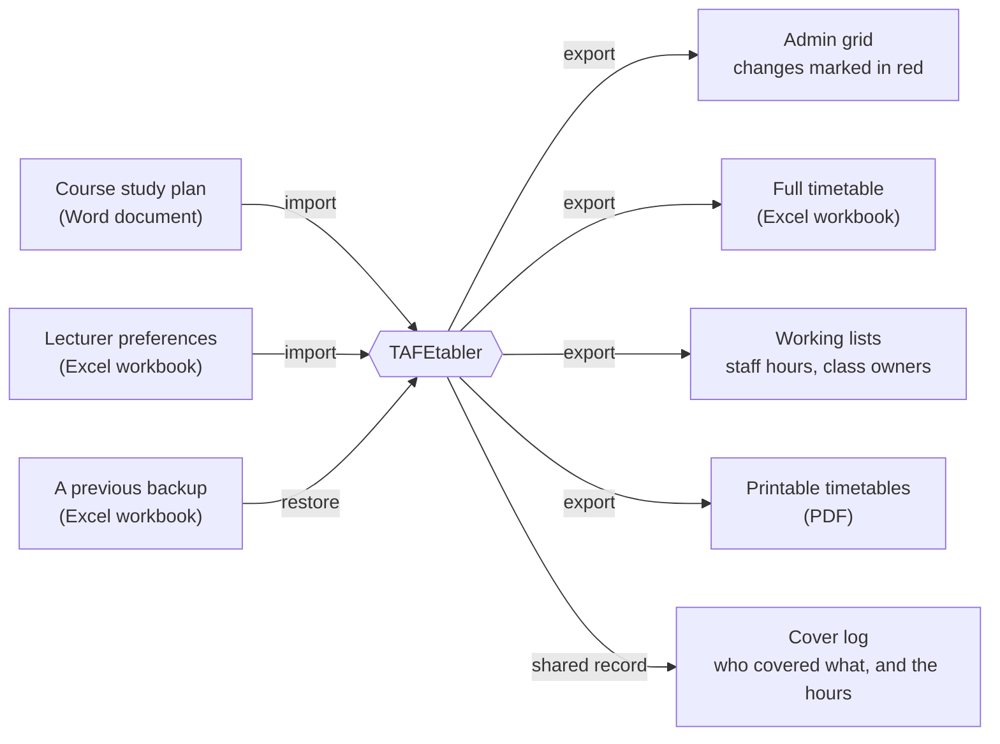

# TAFEtabler — how the program fits together

> A high-level map of the system, written to be explained out loud.
> The first part is for anyone; the technical annex at the end is for IT.

---

## What the program is for

TAFEtabler builds and maintains teaching timetables. Someone takes a set of
courses, classes, lecturers and rooms, places each class into a slot in the
week, and the program watches for the things that would make that timetable
impossible — a lecturer in two places at once, a room too small for the group,
a class scheduled on someone's day off. Around that core sits the everyday
administration a timetable actually needs: arranging cover when a lecturer is
away, tracking who owns each class, publishing the timetable to the people who
have to read it, and keeping a record of what changed and why. It runs in a web
browser, with a companion phone app so lecturers can check their own week.

---

## The main picture

Diagram source (for editing — see diagrams/README.md)

**Reading it left to right and top to bottom:**

- **Browser app** — where the timetabling is done. Drag a class onto the grid,
  assign a lecturer and a room, look at warnings, run exports.
- **Phone app** — a deliberately narrow, read-only view. A lecturer picks their
  name and sees their week. It cannot change anything.
- **Sign-in and permissions** — everyone signs in with a passphrase and a code
  from an authenticator app. This part also decides what each person may do:
  some can edit a timetable, some can only look at it.
- **Request handler** — the middle of everything. Every action from either app
  arrives here, and nothing reaches the stored data without passing through it.
- **Timetabling rules** — the part that knows what makes a timetable valid.
  Given the current state, it reports the clashes. It is the same body of rules
  wherever it is used, so a warning means the same thing everywhere.
- **Document handling** — everything involving a Word or Excel file: reading
  course study plans and preference workbooks in, writing timetables, admin
  grids and backups out.
- **Database** — the source of truth. Courses, classes, lecturers, rooms, every
  placed class, the change history, the cover records, the user accounts.
- **Fast recall** — a short-term memory of recently calculated clash results, so
  the grid stays quick while someone is dragging classes around. It holds nothing
  that could not be recalculated from the database.
- **Timetable session** — the unit people actually work in: one campus or area's
  timetable for a period. Most work happens inside one session.
- **Global workspace** — groups several sessions that share lecturers and shared
  records. It has no timetable of its own; it is the layer that lets you see a
  lecturer's whole load across campuses, and keeps one shared cover log.
- **Built-in tutorial** — three guided tutorials that run inside the real app.
  Each learner gets a private practice session so nothing they do touches real
  timetables.

---

## What flows in and out

Diagram source (for editing — see diagrams/README.md)

**Coming in:**

- **Course study plans** — the Word document a qualification arrives as. Importing
  it creates the qualification with all its classes, hours and unit codes, instead
  of someone typing them in.
- **Lecturer preferences** — a workbook sent to each lecturer each semester, asking
  which classes they would like, their non-teaching day, and times they cannot
  work. Importing the completed workbook writes all of that onto their profiles,
  where it then produces warnings if the timetable contradicts it.
- **A previous backup** — the full timetable export can be read straight back in
  to rebuild a session as it was.

**Going out:**

- **Admin grid** — the term-week workbook administration works from, with anything
  that changed since the original timetable filled in red so nobody has to compare
  two versions by eye.
- **Full timetable** — the whole session in one workbook. It reads as a report but
  is also a complete copy, which is what makes the restore above possible.
- **Working lists** — staff hours, class owners and similar, for meetings and for
  people who need the information outside the app.
- **Printable timetables** — PDFs for handing out or pinning up.
- **Cover log** — the shared record of cover that has actually happened, kept at
  the workspace level so every campus's cover sits in one place.

---

## One journey, end to end: a lecturer is away

This is the most useful thing to be able to walk through, because it touches
most of the parts.

1. **Someone opens the Lecturer cover screen** in the browser app. The sign-in
   layer has already established who they are and that they may edit this
   session.
2. **They choose the lecturer who is away, and the week.** The screen shows that
   lecturer's timetable for the week; every class on it is a candidate for cover.
3. **They pick a class and look at who could take it.** The program lists the
   other lecturers and marks two things: who is already teaching at that time,
   and who is *under* their contracted hours — because covering counts towards
   making those hours up, so those are the people to ask first.
4. **They assign someone.** This creates a *pending cover request* — a plan, not
   yet a fact. Its date is worked out from the week and the day the class falls
   on, so a whole week's cover can be planned at once.
5. **They copy the list and email it.** The pending requests copy out as a table
   ready to paste into an email, including what each cover lecturer is owed before
   and after the job, so the request explains itself.
6. **If the absence runs longer, they repeat the week.** One button copies the
   last week of the plan forward seven days.
7. **A lecturer replies yes, and the request is pushed to the log.** It stops
   being a plan and becomes a record: it moves to the global workspace's cover
   log, and the hours are credited to that lecturer's running total.
8. **The change is visible everywhere it should be.** The workspace's cover log
   shows the job alongside every other campus's; the lecturer's hours reflect it;
   and if the timetable itself was edited, the change log recorded that too — and
   the next admin export will show it in red.

---

## Glossary

These are the terms that are specific to this program, and the ones easiest to
get wrong.

| Term | What it means |
|---|---|
| **Session** (timetable session) | One campus or area's timetable for a period. The main thing people work inside. |
| **Global workspace** | A group of sessions that share lecturers and shared records. Has no timetable of its own. Sometimes called a global group. |
| **Group** | A cohort of students who are timetabled together. Shown by a code such as CYB-A. Stored as a "course". |
| **Class** | A subject being taught, carrying one or more unit codes. Stored as a "unit" — so "classes" and "units" refer to the same thing in different places. |
| **Placecard** | One class placed on the grid at a particular day and time. The blocks you drag. |
| **Holding area** | The tray of classes that belong to a group but have not been placed on the grid yet. |
| **Custodian** | The lecturer who owns a class — keeps its materials current and answers for its delivery. Worked out from who teaches it most, and can be set by hand. |
| **Stage** | A part of a qualification timetabled separately, such as Stage 1 and Stage 2. Each stage is its own record, but the app shows them as one qualification. |
| **Cover** | Arranging another lecturer to take a class when the usual one is away. |
| **Clash** | Something that makes a timetable invalid or inadvisable — the program separates hard problems from softer warnings. |

---

## Technical annex — for IT

Everything above in the terms an IT department will ask about.

### What it is built from

| Layer | Technology |
|---|---|
| Browser app and phone app | React (TypeScript), served as static files |
| Server | Python, FastAPI |
| Database | PostgreSQL |
| Short-term cache | Redis |
| Shared timetabling rules | A Python package used by the server |
| Web server / TLS | Caddy, with automatic Let's Encrypt certificates |
| Packaging | Docker Compose — four containers on one host |

### Hosting

A single virtual machine, reached at `timetabler.rbfe.com.au`. Four containers
run side by side: the web server, the application server, the database, and the
cache. Deployment copies the code to the machine and rebuilds those containers;
database schema changes are applied as versioned migration steps, so an upgrade
never depends on someone remembering to run something by hand.

### Where the data lives

All persistent data is in the PostgreSQL database on that machine, in a Docker
volume — around thirty tables covering timetables, people, rooms, the change
history, cover records and user accounts. The Redis cache holds only recently
calculated clash results and can be discarded at any time without loss.

**Backups.** The application's own full-timetable export is a complete copy of a
session and can be imported to rebuild it, so any session can be exported to a
file and kept off the machine. That is a per-session backup performed by a user,
not a scheduled whole-database backup — **a scheduled database-level backup is
not currently configured, and is the main gap worth closing.**

### Sign-in and access

- Passphrases follow the ACSC's guidance: 14 characters minimum, no composition
  rules, no forced expiry, with common and self-referential choices screened out.
  They are stored hashed with bcrypt.
- **Two-factor authentication is mandatory.** The second factor is a time-based
  code from an authenticator app (TOTP). Nothing is sent by email or SMS, and the
  shared secret never leaves the server.
- Signing in has two steps. Passing the password issues a short-lived token that
  proves only that, and is rejected by every part of the application; only after
  a valid code is a real session issued.
- Ten single-use recovery codes are issued at enrolment, stored hashed. An
  administrator can reset any account's two-factor, which also forgets every
  device that account had trusted.
- A browser can be remembered for 30 days to avoid asking for a code every time;
  the marker is stored hashed and expires on its own.
- Within the application, permissions are per person and per session: some may
  edit a timetable, some may only view it. Administrators manage accounts.
- Sign-in attempts are rate-limited by address, and repeated wrong codes lock an
  account for 15 minutes.

### What leaves the machine

Nothing, other than files a user chooses to download. There are no third-party
analytics, no external APIs called during normal use, and no data sent to any
outside service. QR codes — for the phone app and for two-factor enrolment — are
drawn on the machine rather than fetched from an image service, precisely so that
internal addresses and secrets are not handed to a third party.

### One clarification worth having ready

The shared timetabling package includes an automatic scheduling solver, but
**the web application does not use it.** Timetables here are built by people; the
program's job is to check the result and warn about problems, not to generate a
timetable on its own. If someone asks whether the system "auto-timetables", the
accurate answer is no — not in this version.
